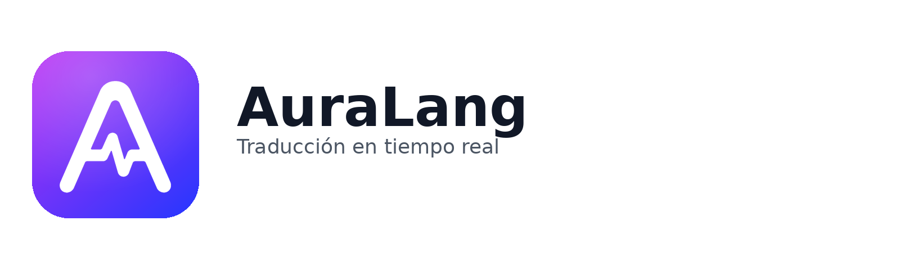

<p align="center">
  <picture>
    <source media="(prefers-color-scheme: dark)" srcset="icons/auralang_logo_pack/presentation/wordmark-dark.png">
    
  </picture>
</p>

<p align="center">
  <strong>Real-time audio translation for any browser tab.</strong><br>
  Transcribes locally with Whisper, translates, and reads it back aloud — no API key, no account.
</p>

<p align="center">
  <a href="#-status"></a>
</p>

<p align="center">
  
  
  
  
  
</p>

---

## 🚧 Status

**Coming soon to the Chrome Web Store.**

The store listing is in review. Once it's live, the install link will be right here:

> 🔗 **Chrome Web Store:** _coming soon_ — meanwhile, [run it locally](#-run-it-locally).

## ✨ What it does

Watching a talk, a podcast, or a video in a language you don't speak? AuraLang listens to the tab, translates on the fly, and speaks the result — so you can **watch the screen instead of reading subtitles**.

- 🎧 **Any tab with audio** — videos, calls, podcasts, live streams.
- 🧠 **On-device transcription** — Whisper runs locally; audio never leaves your machine.
- 🗣️ **Spoken translation** — the original tab audio is muted; you only hear the translation.
- 🔒 **No key, no account, no backend** — settings live only in your browser.
- 🌗 **Light & dark themes**, interface in **English and Spanish**.

## ⚙️ How it works

```
Tab audio ─▶ Whisper (local transcription) ─▶ Google Translate ─▶ Web Speech API (spoken output)
```

Audio is buffered and cut on natural speech pauses, transcribed on-device, translated, and read aloud through the browser's built-in voice. The original tab audio is muted while capturing.

## 🚀 Run it locally

**Requirements:** Google Chrome 116+

```bash
npm install
npm run build
```

Then in Chrome:

1. Open `chrome://extensions`
2. Enable **Developer mode** (top-right)
3. Click **Load unpacked** → select the `dist/` folder
4. Open the popup, pick source & target languages, and hit **Start translation**
5. Switch to any tab with audio and enjoy

> First run downloads the Whisper model (~150 MB) once; it's cached locally afterwards.

## 🛠️ Development

```bash
npm run dev         # Vite dev server (reload the extension after changes)
npm run type-check  # TypeScript, no emit
npm run lint        # ESLint
npm run test        # Jest + React Testing Library
npm run zip         # Build + package dist.zip for the Web Store
```

## 🧱 Tech stack

| Layer | Tool |
|---|---|
| Extension API | Chrome MV3 — `tabCapture`, `offscreen`, `storage` |
| Build | Vite + `@crxjs/vite-plugin` |
| UI | React 18 + TypeScript (strict) |
| Styles | Tailwind CSS |
| Transcription | Whisper via `@huggingface/transformers` (local, offscreen document) |
| Translation | Google Translate (free, unofficial endpoint) |
| Speech | Web Speech API (`speechSynthesis`) |

## 📁 Project structure

```
src/
  background/   # Service worker — tabCapture + offscreen lifecycle
  offscreen/    # AudioContext + transcription / translation / TTS pipeline
  popup/        # React UI
    components/ # Header, StatusHero, WaveformIndicator, LanguageSelect, SettingsPanel…
    hooks/      # useApiConfig, useTranslation, useI18n, useTheme
  welcome/      # First-install onboarding page
  services/     # transcriptionService, translationService, ttsService
  types/        # Shared TypeScript interfaces
```

## 🔐 Privacy

No backend, no telemetry, no account. Transcription happens on your device; only the transcribed **text** is sent to Google Translate to get the translation back. Settings (languages, theme) are stored in `chrome.storage.local` on your machine. Full details in [PRIVACY.md](./PRIVACY.md).

## 📚 Docs

- [AGENTS.md](./AGENTS.md) — architecture, TypeScript, services, testing & accessibility conventions (source of truth for contributors).
- [PRIVACY.md](./PRIVACY.md) — privacy policy.

## 📦 Publishing

```bash
npm run zip
```

Upload `dist.zip` to the [Chrome Developer Dashboard](https://chrome.google.com/webstore/devconsole).

---

<p align="center"><sub>Built with care — concepts before code.</sub></p>
